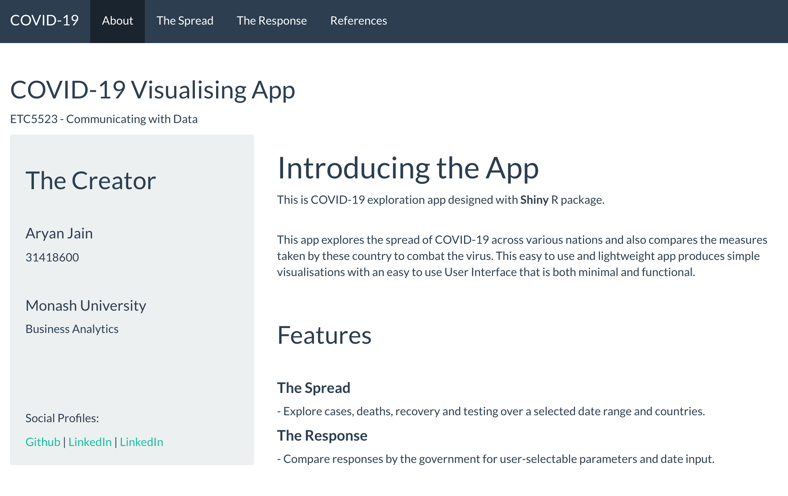

```{r setup, include=FALSE}
knitr::opts_chunk$set(echo = FALSE, warning = FALSE, message = FALSE)
```


```{r}
library(knitr)
```

I am thrilled to introduce a brand new app for tracking the progress of COVID-19 spread as well as the measures taken by governments across the globe.

The app allows the user to quickly analyse the situation of the novel coronavirus in any given country and draw comparisons for further analysis.

Available on both Desktop and mobile.

](images/thespread.gif)

## Designing  the App

The app consist of 3 major modules:

- **About Section**: This section contains the basic description of the app  as well as some information about the creator.

```{r}

```

- **The Spread**: This section explore the cases, deaths, recovery and testing over a selected date range and for various user-selectable countries.

- **The Response**: This section will compare responses by the government for user-selectable parameters such as testing policy, school and workplace closing.


## Self Review

### Pros

The app is structured quite well and layout is simple and efficient. The use of tabs and sub tabs help reduce the visual clutter and allows more content to fit a particular window without overwhelming the user.

The app opens up to the about section which explains the purpose and working of the app so first time users will not struggle looking through the app.

Both sections allow the user to see information for various countries in the single plot which will help in making comparisons and give a far more accurate idea of how good or bad a country is doing with their limited resources and respective geography.

Furthermore, all individual modules are well defined with simple to understand controls and consistent theme throughout the app which helps greatly in making the app user-friendly. A cluttered UI can make users uncomfortable and leave a bad first impression.

The app is not overly complex and computationally heavy and hence is quite quick to respond even with the use of relatively heavy plot engines such as plotly and leaflet.

### Shortcomings

Unfortunately, the app isn't flawless. While, it is important for an application to be easy on the eyes and inviting to the technophobic audience, one must make the best use of the screen space and pack as much content on the screen as visually and technically feasible without disturbing the aesthetics of the presentation and without drastically increasing the complexity of the app.

I feel like I could have made better use of the space and added more content on the screen including additional controls and information about the plot. In the second section titled *the Spread*, it would probably make more sense to include the plot and the table on the same page rather than different sub-tabs to maximize efficiency and allow users to draw parallels.

Moreover, the table in the said section could have also shown some statistical information about the selected countries which may have been more useful.

Also, in the third section titled *the response* the legend should've had discrete bins as it would've made more sense. Additionally, I would have liked to include a choropleth map in this section instead of circle markers. However, it proved to be quite a lot more complicated and didn't seem like a sensible choice given the time frame.

A choropleth map would've also allowed me to include a lot more countries without looking overcrowded.

Furthermore, the figures should have been labeled even if it was sufficiently clear what was being presented.

I should also add that there was a typography error in the about section as the *kaggle* profile was named as *LinkedIn*.


### Additional functionality

I would have also liked to include the capability to detect the location of the user using geo-location which would automatically show information of neighboring countries in the leaflet plot in *the response* section as well as the plotly plot in *the Spread* section as default. However, it would be way beyond the scope of this project and may not be technically feasible at this point.

I would've also liked to include the total *active cases* in *the Spread* section which was unfortunately not present in the data and was not that readily available as per my research.

## Reference

Guidotti, E., Ardia, D., (2020), "COVID-19 Data Hub", Journal of Open Source Software 5(51):2376, doi: 10.21105/joss.02376.